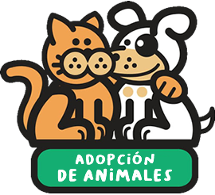

<h1 align="center" >
    
</h1>
<h2 align="center" >
    Aplicación en Django para Adopción de Animales! 🐍🐶🐺  
    
    
</h2>

<h1>⚈ Acerca de 'Adopción de Animales'</h1>
Es una aplicación web desarrollada en el framkework de python llamado Django. 

Este repositorio ha sido realizado gracias al mini curso que [Codigo Facilito](http://codigofacilito.com/) dispuso por medio de su canal de youtube en Junio del 2016. [Videos de Youtube](https://www.youtube.com/playlist?list=PLsRdPvQ2xMkH8c2BOnQ_O1KZ9lyyL_eGB). Este es el [repositorio original](https://github.com/angiealejo/curso_django_codigofacilito) realizado por Angie Alejo

<h1>⚈ Más Información</h1>
Para este proyecto he usado Django 3.2 y Python 3.8. 
Use Poetry para aislar mi ambiente.
Si no se desea usar poetry, recomiendo seguir los siguientes pasos:

* Aislar ambiente: Ejecutar comando `python -m venv .venv` dentro de la carpeta del proyecto clonado.
* Activar ambiente [Windows]: `.venv\Scripts\activate` 
* Activar ambiente [Linux]: `.venv\bin\activate`
* Instalar dependencias: `pip install -r requirements.txt`

<h4 align="center"> 
	🚧  Aplicación Web siempre en construcción...  🚧
</h4>
